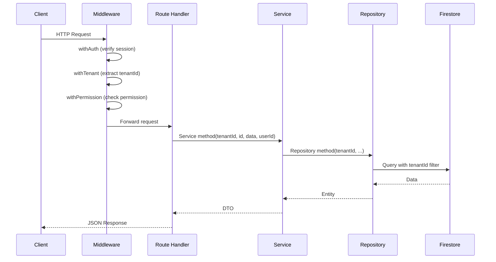
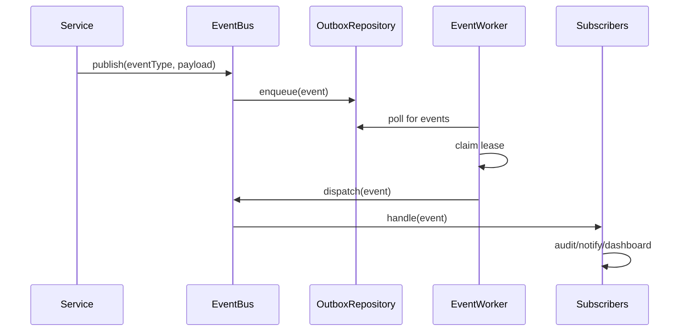

# Data Flow

**Document ID**: EDU-DATA-001  
**Version**: 1.0  
**Date**: 2026-07-26  
**Status**: Canonical  
**Owner**: CTO Office, EduPilot Engineering  
**Classification**: Internal — Engineering Governance  

---

## 1. Request Flow

## 2. Event Flow

