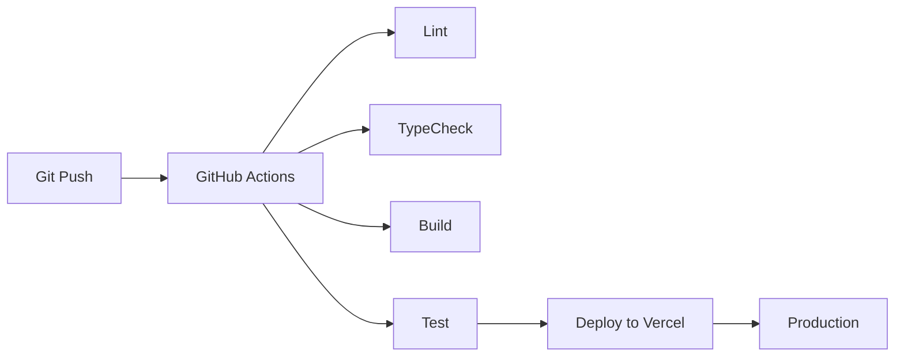

# Deployment Architecture

**Document ID**: EDU-DEPLOY-001  
**Version**: 1.0  
**Date**: 2026-07-26  
**Status**: Canonical  
**Owner**: CTO Office, EduPilot Engineering  
**Classification**: Internal — Engineering Governance  

---

## 1. Deployment Model

| Component | Platform | Purpose | Evidence |
| --- | --- | --- | --- |
| Frontend | Vercel | Next.js hosting | package.json |
| API | Vercel Serverless | API routes | Next.js configuration |
| Database | Firebase Firestore | Primary data store | lib/firebase-admin.ts |
| Cache/Queue | Redis Cloud | Caching and BullMQ | EDUPILOT_MASTER_FACTS.md |
| AI | Google Gemini API | LLM provider | EDUPILOT_AI_CATALOG.md |
| Email | Resend + SendGrid | Transactional email | EDUPILOT_SAAS_CATALOG.md |
| SMS | Twilio | SMS notifications | EDUPILOT_SAAS_CATALOG.md |
| Payments | Stripe | Billing | EDUPILOT_SAAS_CATALOG.md |
| Real-time | Pusher | In-app notifications | EDUPILOT_SAAS_CATALOG.md |
| Monitoring | Unknown | Observability | UNKNOWN |

## 2. Environment Strategy

| Environment | Purpose | URL Pattern | Evidence |
|-------------|---------|-------------|----------|
| Development | Local development | localhost:3000 | package.json |
| Staging | QA and UAT | staging.edupilot.com | UNKNOWN |
| Production | Live system | edupilot.com | UNKNOWN |

## 3. CI/CD Pipeline

