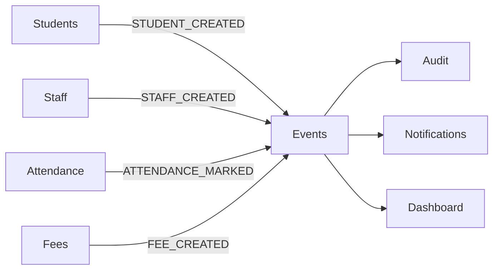

# Module Interactions

**Document ID**: EDU-MODINT-001  
**Version**: 1.0  
**Date**: 2026-07-26  
**Status**: Canonical  
**Owner**: CTO Office, EduPilot Engineering  
**Classification**: Internal — Engineering Governance  

---

## 1. Interaction Matrix

| From Module | To Module | Interaction Type | Mechanism | Evidence |
| --- | --- | --- | --- | --- |
| Students | Attendance | Query | AttendanceService.getByStudent() | EDUPILOT_MASTER_FACTS.md |
| Students | Fees | Query | FeesService.getByStudent() | EDUPILOT_MASTER_FACTS.md |
| Students | Parents | Query | ParentService.getByStudent() | EDUPILOT_MASTER_FACTS.md |
| Students | Dashboard | Aggregate | DashboardService.getStudentStats() | EDUPILOT_MASTER_FACTS.md |
| Staff | Attendance | Query | AttendanceService.getByStaff() | EDUPILOT_MASTER_FACTS.md |
| Staff | Timetable | Query | TimetableService.getByStaff() | EDUPILOT_MASTER_FACTS.md |
| Attendance | Dashboard | Aggregate | DashboardService.getAttendanceStats() | EDUPILOT_MASTER_FACTS.md |
| Fees | Dashboard | Aggregate | DashboardService.getFeeStats() | EDUPILOT_MASTER_FACTS.md |
| Events | All | Event | EventBus.publish() | EDUPILOT_EVENT_CATALOG.md |
| Notifications | All | Event | NotificationSubscriber | EDUPILOT_EVENT_CATALOG.md |

## 2. Event-Based Interactions

