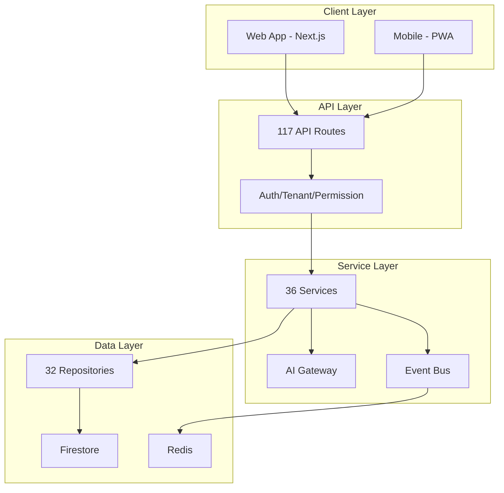

# System Overview

**Document ID**: EDU-SYS-001  
**Version**: 1.0  
**Date**: 2026-07-26  
**Status**: Canonical  
**Owner**: CTO Office, EduPilot Engineering  
**Classification**: Internal — Engineering Governance  

---

## 1. System Purpose

EduPilot is an Enterprise Multi-Tenant AI-Powered School Management SaaS platform built with Next.js, TypeScript, Firebase, and Gemini AI.

## 2. Technology Stack

| Layer | Technology | Purpose | Evidence |
| --- | --- | --- | --- |
| Frontend | Next.js 14 + React | UI framework | package.json |
| Language | TypeScript | Type safety | tsconfig.json |
| Database | Firebase Firestore | Primary data store | lib/firebase-admin.ts |
| Authentication | Firebase Admin Auth | User authentication | lib/auth/auth-server.ts |
| AI | Google Gemini | LLM provider | EDUPILOT_AI_CATALOG.md |
| Queue | BullMQ + Redis | Background jobs | EDUPILOT_MASTER_FACTS.md |
| Payments | Stripe | Billing | EDUPILOT_SAAS_CATALOG.md |
| Email | Resend + SendGrid | Transactional email | EDUPILOT_SAAS_CATALOG.md |
| SMS | Twilio | SMS notifications | EDUPILOT_SAAS_CATALOG.md |
| Real-time | Pusher | In-app notifications | EDUPILOT_SAAS_CATALOG.md |
| Push | Firebase Cloud Messaging | Mobile push | EDUPILOT_SAAS_CATALOG.md |

## 3. System Boundaries

