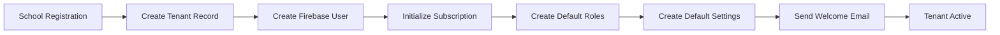

# Tenant Architecture

**Document ID**: EDU-TENANT-001  
**Version**: 1.0  
**Date**: 2026-07-26  
**Status**: Canonical  
**Owner**: CTO Office, EduPilot Engineering  
**Classification**: Internal — Engineering Governance  

---

## 1. Multi-Tenancy Model

EduPilot uses **shared database, shared schema** multi-tenancy with application-level row filtering.

## 2. Tenant Isolation

| Layer | Isolation Mechanism | Status | Evidence |
| --- | --- | --- | --- |
| Middleware | withTenant extracts tenantId | ✅ Active | EDUPILOT_SECURITY_CATALOG.md |
| Repository | All queries filter by tenantId | ✅ Active | EDUPILOT_MASTER_FACTS.md |
| Service | tenantId parameter in all methods | ✅ Active | EDUPILOT_MASTER_FACTS.md |
| Database | tenantId column on all collections | ✅ Active | EDUPILOT_DATABASE_ARCHITECTURE.md |
| Cache | Tenant-prefixed Redis keys | ⚠️ Partial | EDUPILOT_MASTER_FACTS.md |
| Encryption | No tenant-level encryption | ❌ Missing | EDUPILOT_SECURITY_CATALOG.md |

## 3. Tenant Lifecycle

## 4. Tenant Limits

| Plan | Max Students | Max Staff | Max Classes | Max Storage | Evidence |
| --- | --- | --- | --- | --- | --- |
| Free | 50 | 10 | 10 | 1GB | EDUPILOT_SAAS_CATALOG.md |
| Starter | 200 | 50 | 50 | 10GB | EDUPILOT_SAAS_CATALOG.md |
| Professional | 1000 | 200 | 200 | 50GB | EDUPILOT_SAAS_CATALOG.md |
| Enterprise | 999999 | 999999 | 999999 | 100GB | EDUPILOT_SAAS_CATALOG.md |

