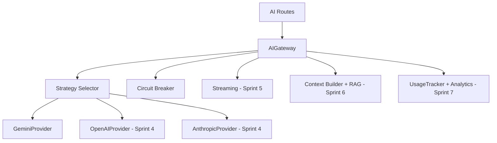

# AI Implementation Plan

**Date**: 2026-07-26T11:09:27.157614  
**Status**: Final  
**Owner**: CTO Office

---

## Current State

| Component | Status | Gap |
| --- | --- | --- |
| Provider | Gemini (working) | No fallback |
| Strategies | 8 strategies | Limited coverage |
| Prompts | 2 templates | Limited library |
| Streaming | Missing | Poor UX |
| Context | Basic | Limited RAG |
| Safety | PromptGuard | Basic moderation |
| Monitoring | UsageTracker | Basic tracking |

## AI Roadmap

| Phase | Sprint | Objective | Deliverables |
| --- | --- | --- | --- |
| 1 | 4 | Reliability | Fallback provider (OpenAI/Anthropic), circuit breaker |
| 2 | 5 | UX | Streaming responses, typing indicators |
| 3 | 5-6 | Quality | Expanded prompt library, context optimization |
| 4 | 6 | Intelligence | RAG implementation, vector search |
| 5 | 7-8 | Analytics | AI cost tracking, usage analytics, A/B testing |

## AI Architecture Evolution

