# Document Relationship Graph

**Date**: 2026-07-26T10:50:53.482770  
**Status**: Final

---

## Dependencies

```mermaid
graph TD
    README --> 00-governance/PRD.md
    README --> 01-architecture/ARCHITECTURE.md
    README --> 02-engineering/ENGINEERING_RULES.md
    PRD --> ROADMAP.md
    PRD --> SUCCESS_METRICS.md
    ROADMAP --> PHASES.md
    ARCHITECTURE --> DOMAIN_MODEL.md
    ARCHITECTURE --> DATA_FLOW.md
    ARCHITECTURE --> DEPENDENCY_GRAPH.md
    ENGINEERING_RULES --> CODING_STANDARDS.md
    ENGINEERING_RULES --> API_GUIDELINES.md
    ENGINEERING_RULES --> DEFINITION_OF_DONE.md
    MASTER_FACTS --> API_CATALOG
    MASTER_FACTS --> MODULE_CATALOG
    MASTER_FACTS --> SECURITY_CATALOG
```

## Cross-Reference Validation

All internal links validated. No broken references found.

